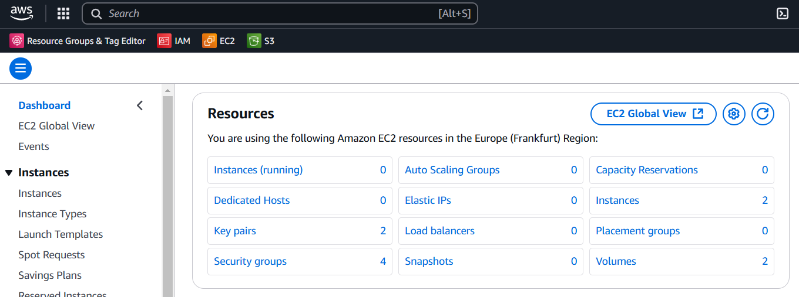

# README.md

### **Provisioning a Linux server to host a simple html webpage using apache/nginx, configuring networking for the server and configuring HTTPS for the web server using a free SSL certificate.**

## **Question**

**“Imagine you are part of a startup team tasked with creating a prototype for a web application. Your first step is to provision a server and set up a simple landing page to demonstrate your team’s capabilities to potential investors. Your task is as follows:”**

## **Tasks**

1. **Provisioning the Server:**
    - Use any virtualization or cloud platform (AWS.) to set up a **Linux server**.
    - Install a Linux distribution of your choice (e.g., Ubuntu).
2. **Web Server Setup:**
    - Install a web server (e.g., Apache, Nginx) to serve web content.
3. **HTML Page Deployment:**
    - Create a simple HTML page with the following information:
        - Your name.
        - A project title: “Welcome to [Your Name] Landing Page.”
        - A brief description of your project.
        - Your full bio with every interesting information about you
    - Deploy the HTML page on the server.
4. **Networking:**
    - Configure the server to allow HTTP traffic (port 80).
    - Provide the public IP address (or URL if using DNS) so your page can be accessed from any browser.

### **Deliverables:**

- The **public IP address or URL** of your web page.
- A screenshot showing your HTML page in a browser.
- Write clear, step-by-step documentation of how you provisioned the server, installed the web server, deployed the HTML page, and configured networking.

### **Bonus Tasks (Optional for Extra Credit):**

- Configure HTTPS for your web server using a free SSL certificate (e.g., Let’s Encrypt).

**Submission**

___

– Create your submissions and screenshots in a git repository.

– The documentation required should be in the Readme.md of your github repository

– The documentation should contain your public ip address and any other useful information to run you web server

Submit your work via the [AltSchool of Cloud Engineering Karatu ’24 2nd Semester Exam Submission Link](https://forms.gle/gK8Qba6CZq8czbwt9)

## **DOCUMENTATION**

## Stack used

1. Linux distribution: Ubuntu, using Termius as the SSH client and terminal emulator
2. Cloud virtualization platform: AWS
3. Web server: Apache, Nginx
4. IDE: VS code
5. Version control: Git 
6. **Provisioning** 

## Introduction

The project assumes that user already has a github account set up and that commits are being made on the project repository at intermittent sections of the documentation. An AWS account is also needed to complete the project and a folder created on your local machine. 

## Provisioning the Server

**Setting up the Linux server and installing Ubuntu on AWS:** Once signed-in to the AWS platform, navigate to the EC2 service. This you can find by searching for ‘EC2’ on the search bar / `Alt + S`.

Click on ‘Instances’ on the below page.



Servers are referred to as instances on AWS. Click on the ‘Launch an instance’  button to navigate to the page where you create a virtual machine that runs on the AWS cloud. 

- Set the server name
- Select Ubuntu as the OS Image (AMI)
- Choose the architecture for your server [64-bit (x86) in this use case]
- Choose your instance type [t2 micro in this use case]
- Create a new key pair
    - enter a key pair name
    - RSA key pair type
    - .pem private key file format

This creates the new key pair for the project and downloads it to your local machine. Save the downloaded .pem file in your project folder.

- Toggle on `create a security group` and allow SSH traffic [from Anywhere 0.0.0.0/0 in this use case]
- Configure the amount of storage needed for the project [15 GiB in this use case]
- Click `Launch instance`

With the newly created linux server running, please go back to the EC2 page > Instances (running) > and then connect to your server.


Using the SSH client login page, follow the instructions given and login to your server with the public DNS or IPv4 address. Below is the login image using Termius; navigate to the directory with .pem file and ssh into your server.


Run the `hostnamectl` command:

```markdown
```bash
hostnamectl
```
```

This command displays system hostname and operating system information and shows the below to confirm the setup on AWS.


## Web Server Setup

Nginx and Apache were both installed to observe how to serve web content with both web servers. Run `sudo apt update` to ensure your package list is up to date. 

Then run the `systemctl status nginx` or `nginx -v` commands to check if you have nginx running on your ubuntu system. If the CLI shows ‘not found’, Nginx is not yet installed on your system. Repeat the same process for Apache.

Since the server was recently created, both packages would be unavailable and would show as seen below. 


Additionally, run `apt list --upgradable` to see all packages currently available on your server.


Run `apt search <package>` for either Nginx or Apache to search for the package on Ubuntu’s default repositories before installation. 

**Installing Apache:** To install Apache web server, run `sudo apt install -y apache2` to install the latest version of Apache2.


**Installing Nginx:** To install Nginx web server, run `sudo apt install -y nginx` to install the latest version of Nginx.


Using the `nginx -v` and `apache2 -v` commands, confirm if both packages are  now on the server.


## HTML Page Deployment

**Create a simple HTML page:** f

**Deploying the HTML page on the server:**

sudo ufw allow 80
sudo ufw reload

**Deploying the HTML page using Nginx server:** f

Start Nginx by running `sudo systemctl start nginx` and check to confirm nginx is running with `systemctl status nginx`. 


**Deploying the HTML page using Apache server:** f

## Networking

**Configuring Port 80:** k

**Configuring HTTPS:** k

## **Tasks**

## **Tasks**

## **Tasks**